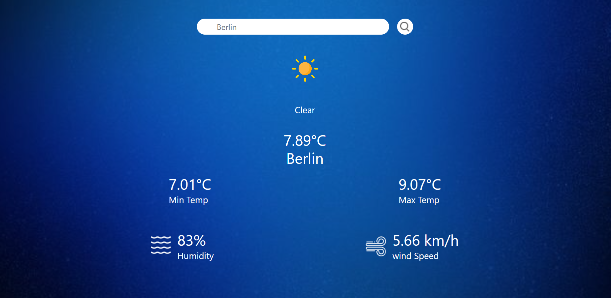

# Weather App using Reactjs and Open Weather API

I created this project using vite so in order to run this app, first use following commands:
1. npm install (To install require npm packages)
2. npm run dev (To run React app)

In this project I used Open Weather API to fetch weather data of a city. I added necessary error handling such as it will show message if use does not enter a city or enter an invalid city name.

